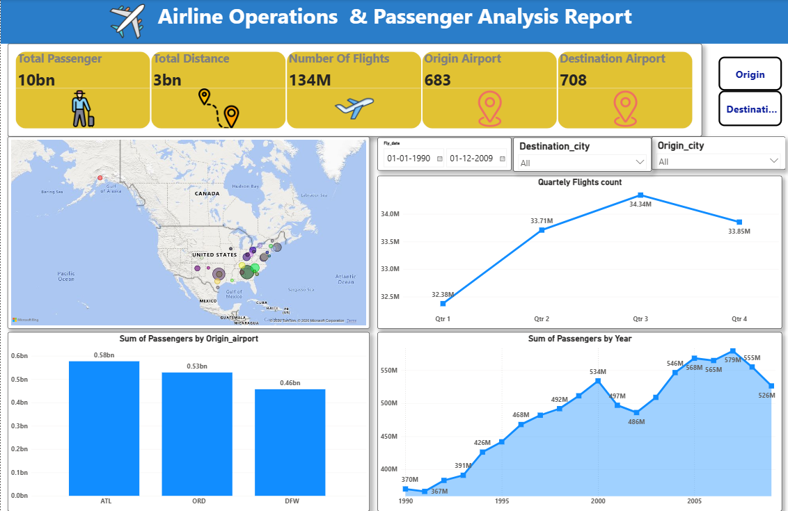

# Airline Operations & Passenger Analytics Dashboard (Power BI)

## Project Overview

This project presents an interactive Power BI dashboard developed to analyse airline operations and passenger traffic. The dashboard provides valuable insights into passenger trends, flight performance, airport activity, and geographical distribution of airline operations.

## Dashboard Preview

## Key KPIs
- Total Passengers
- Total Distance Covered
- Total Number of Flights
- Origin Airports
- Destination Airports

## Dashboard Features
- Passenger Analysis
- Flight Operations Monitoring
- Origin Airport Analysis
- Destination Airport Analysis
- Passenger Trend by Year
- Quarterly Flight Analysis
- Interactive Map Visualization
- Dynamic Filters

## Tools Used
- Microsoft Power BI
- Microsoft Excel
- Power Query
- DAX

## Dataset
Airport & Airline Operations Dataset (Excel)

## Project Structure

Dashboard/

- Global_Airline_Operations_Dashboard_PowerBI.pbit

Dataset/

- Airport_Airline_Dataset.xlsx

Images/

- Dashboard_Overview.png

## Business Insights
- Analyse yearly passenger growth
- Monitor quarterly flight operations
- Identify busiest origin airports
- Compare destination airport traffic
- Visualize airline operations geographically
- Track airport performance

## Skills Demonstrated
- Data Cleaning
- Data Modelling
- Power Query
- DAX Measures
- Dashboard Design
- Business Intelligence
- Interactive Reporting
- Data Visualization

## Project Highlights
- KPI Monitoring (Passengers, Flights, Distance, Airports)
- Year-wise Passenger Trend Analysis
- Quarterly Flight Performance Analysis
- Origin & Destination Airport Insights
- Interactive Map Visualization
- Dynamic Filters for Data Exploration

## Author
Golu Kumar

## License
This project is licensed under the MIT License
